# Proyecto Estudio Accidentes Viales

## Descripción

Como una consultora se ha encomendado el estudio de la Accidentología Vial de la Ciudad Autónoma de Buenos Aires con el objetivo de tener una idea clara de este fenómeno para tomar medidas con perspectiva de aligeramiento de estos siniestros.

## Alcance

El alcance geográfico se limita a la Ciudad Autónoma de de Buenos Aires. Se estudia los siniestros fatales en el período 2016-2021 inclusive y la accidentología no fatal desde el año 2019 al 2021, ya que desde que se tiene disposición de los datos públicamente. 

## Análisis

Los datos que alimentan este estudio son datos públicos provistos por el Gobierno de la Ciudad de Buenos, https://data.buenosaires.gob.ar/dataset/victimas-siniestros-viales, los datasets <code>Homicidios</code> y <code>Lesiones</code> y datos censuales del Gobierno de la Nación Argentina.

El objetivo fue hacer un estudio profundo de estos datos correlacionando las variables que lo componen. Por cada Siniestro:

- Número de víctimas
- Fecha
- Hora
- Lugar
- Tipo de Calle
- Calle
- Altura
- Cruce
- Comuna
- Coordenadas <code>lon</code>, <code>lat</code>
- Participantes
- Víctima
- Acusado
- Gravedad

Con esas dimensiones ya podemos hacer un buen análisis, ya que se dispone información de día hora, geográfica, de tipo de vía, con resultados e involucrados. Se puede complementar con información de la victimologia. Lo más relevante está en la información ya provista y se usa también como complemento la información de los siniestros no fatales.

Luego de realizar una exploración de los datos y obtener correlaciones se implementan 3 KPI.
Los KPI (Indicadores Clave de Desempeño) son métricas que permiten evaluar el desempeño, en este caso entendido como medidas implementadas para alivianar los casos más críticos y nos permitan seguir con esa tónica o implementar nuevas medidas en virtud de los hechos.

Las KPI son:

<b>Tasa de Homicidios</b>

<i>Métrica</i> : Tasa de Homicidios por 100.000 habitantes.

<i>Objetivo</i>: Reducir al menos en un 10%.

<i>Periodo</i>: Semestral.

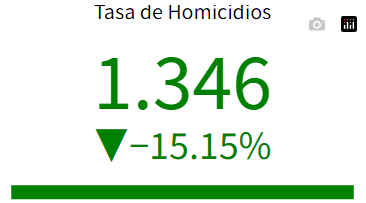

<b>Tasa de Homicidios Motociclistas</b>

<i>Métrica</i>: Tasa de Homicidios de Motociclistas por 100.000 habitantes.

<i>Objetivo</i>: Reducir al menos en un 7%.

<i>Objetivo</i>: Anual.

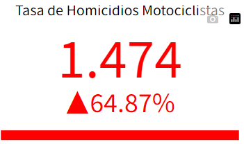

<b>Tasa de Homicidios Motociclistas</b>

<i>Métrica</i>: Tasa de Homicidios en Horas Pico por 100.000 habitantes.

<i>Objetivo</i>: Reducir al menos en un 10%.

<i>Objetivo</i>: Semestral.

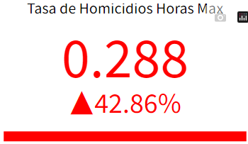

Se implementó un Dashboard o Tablero que permite visualizar lo más relevante y de forma interactiva, luego para entrar en detalles y análisis más profundo. El tablero no tiene que estar sobrepasado de información, sólo la necesaria para tener una buena perspectiva.

Vista de los KPI

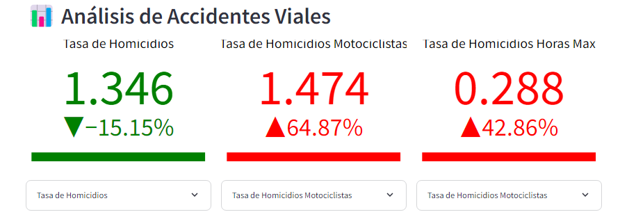

Filtros Interactivos

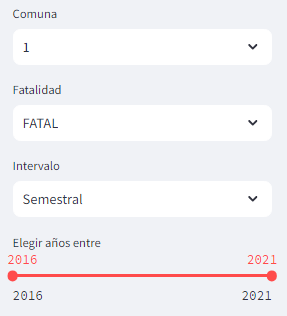

Análisis Temporal

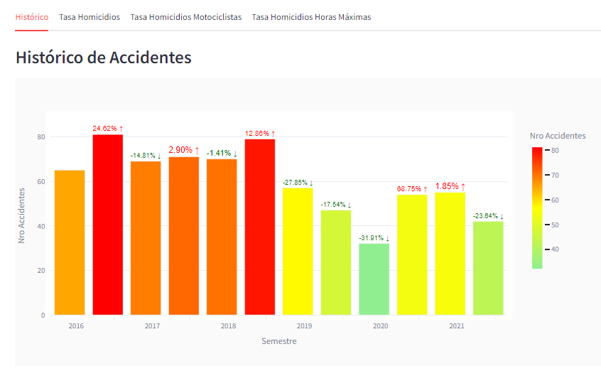

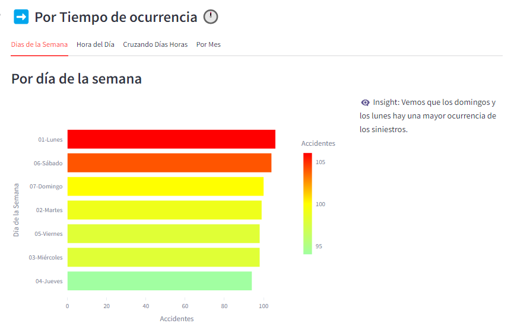

Análisis Geográfico

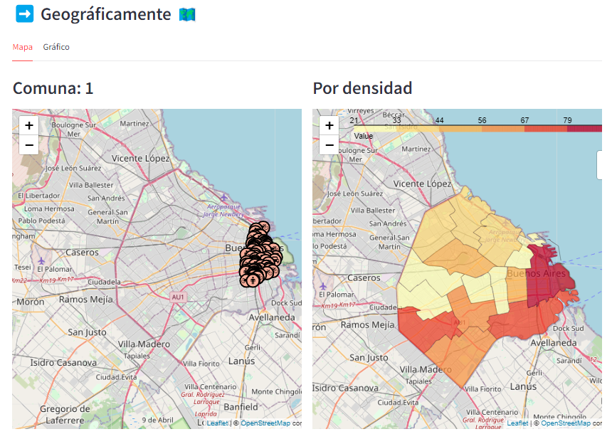

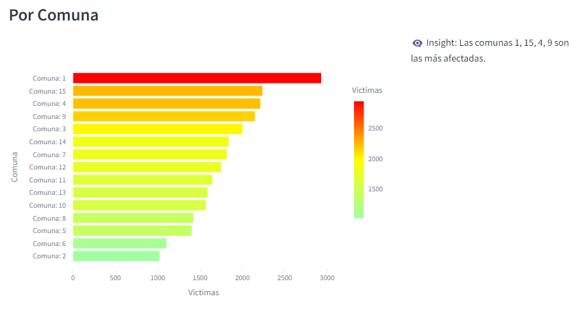

Por Víctimas y Acusados

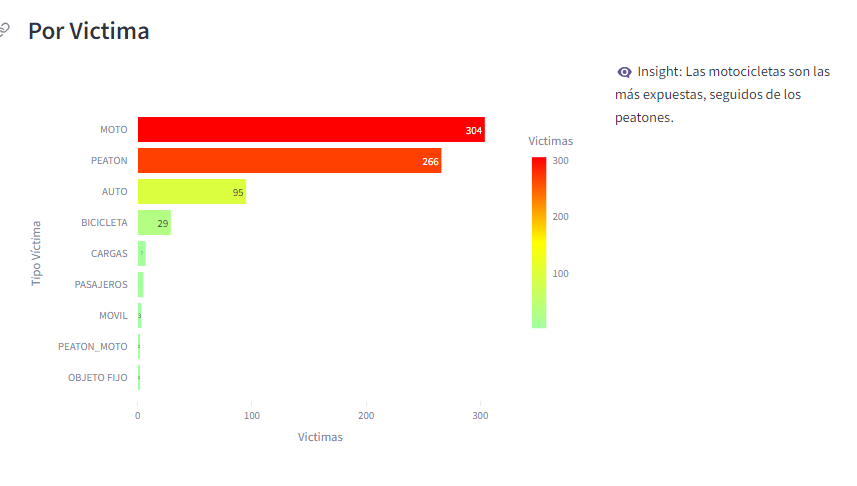

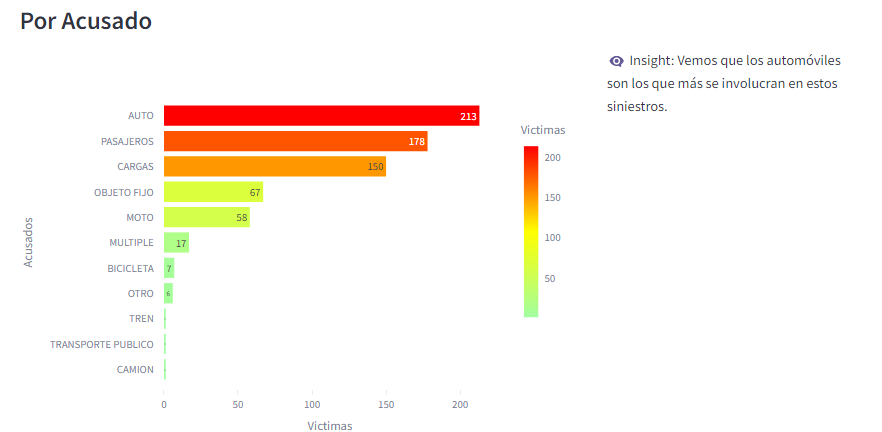

Viales

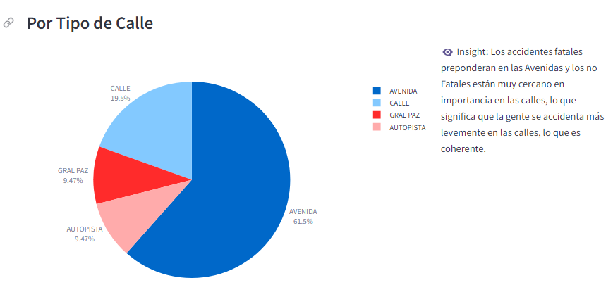

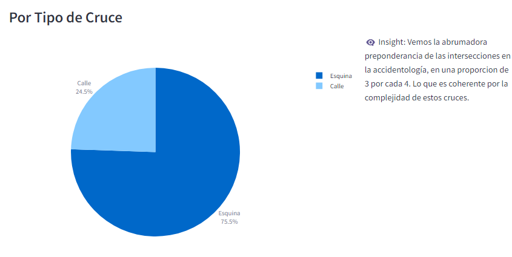

## Conclusión

Se pueden verificar a grandes rasgos que los siniestros ocurren mayormente en las intersecciones, lo más implicados son los automóviles, los más vulnerables son las motocicletas, se ve en la evolución anual que el aislamiento por pandemia redujo los siniestros y que volvió a surgir luego pero en menor medida, que la comuna 1 y las vecinas hacia el oeste son las más afectadas.

Luego la naturaleza de las medidas a implementar se basarán en esos datos y se seguirá su desempeño a través de los KPI's con un horizonte de seis meses a un año.

## Tecnologías Utilizadas

- Python https://www.python.org/
- Streamlit https://streamlit.io/
- Folium https://pypi.org/project/folium/
- Plotly https://github.com/plotly/plotly.py
- Seaborn https://seaborn.pydata.org/
- MySql https://www.mysql.com/

- URL Streamlit APP: https://proyecto-accidentes-viales.streamlit.app/

## Datos Contacto
- Nombre: Javier Bengolea
- Email: javierbengolea38@gmail.com